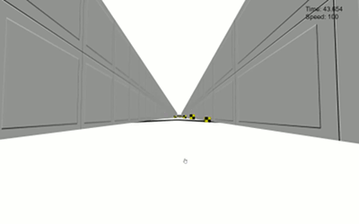

A-FRAME Depth Perception Test + Express + MongoDB
======================================

About
-----

A large number of modern computer games use 3D systems, and it is expected that in the near future this kind of technologies will be even more present in our daily activities.

The existence of low-cost gaming devices, personal computers, and increasingly affordable virtual reality devices allow a greater immersion of players. This, translated into the field of health, makes us anticipate the development of new affordable treatments in wich the patient will be able to experience situations that could hardly be reached during traditional treatment or rehabilitation exercises. This will lead to more complete training and better results.

Due to my background in Psychometrics, I am interested in this type of approaches, and I have found in A-Frame a very interesting environment for the development of potential clinical and/or scientific applications related to the analysis, evaluation, follow-up, or rehabilitation of patients.

In this example I have used A-Frame in the frontend, and Node along with Express and MongoDB in the backend, to develop one of those so-called <a href="https://en.wikipedia.org/wiki/Serious_game">serious games</a> that could, for example, provide information about the <a href="https://en.wikipedia.org/wiki/Depth_perception">depth perception</a> of a group of patients.

How to use it
-------------

You must have a MongoDB instance running on localhost with default port 27017.

$ npm install
$ npm run-script start

Open <a href="http://127.0.0.1:8080/">http://127.0.0.1:8080/</a> in your browser.